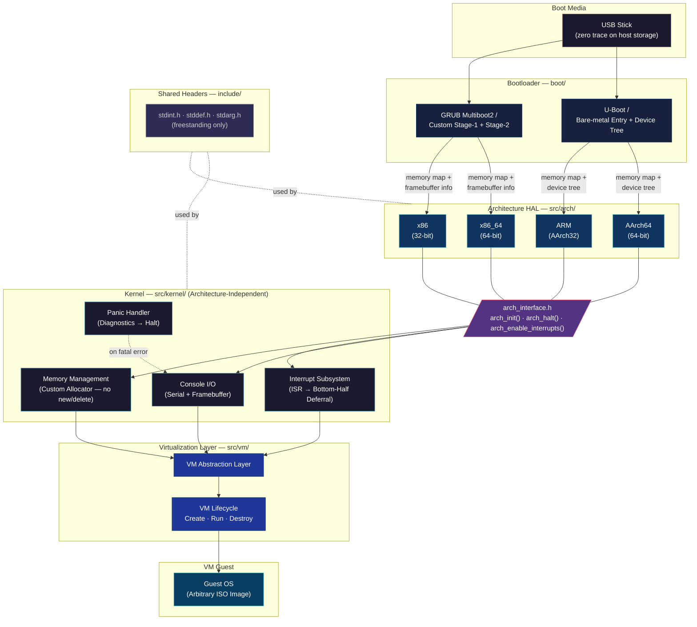

## ZeroOS
A basic Operating System which runs a virtual machine from an ISO image. The point of this is to;
- Learn how to build a basic C++ kernal with Bootloader.
- Spin up an arbitrary Virtual Machine.
- Create an abstract virtualisation layer
- Support ARM and x86 32/64bit Architecture from a low-level OS perspective.

### What is it?
ZeroOS is designed to be a light weight operating system which runs a Virtual Machine and can be booted from a USB stick without leaving any trace on a machine.

### Software Architecture

