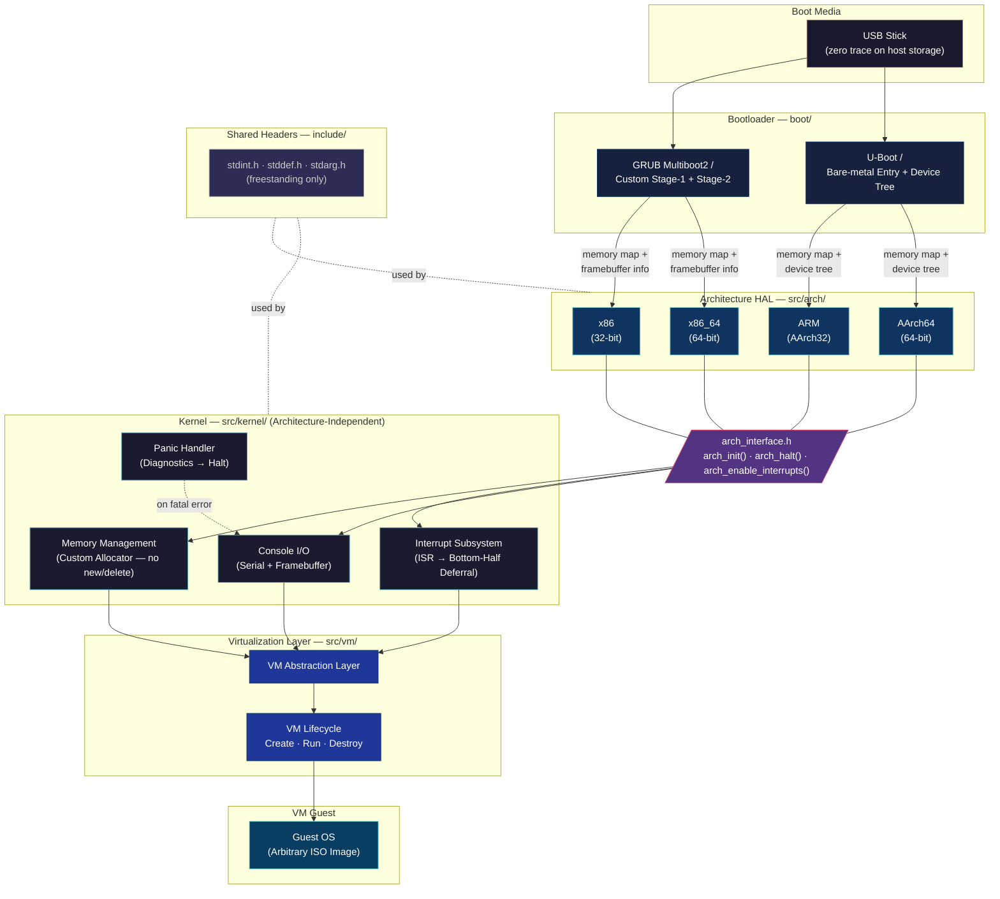

[](https://github.com/BlankFoxGirl/Zero-OS/actions/workflows/ci.yml)

## ZeroOS
A basic Operating System which runs a virtual machine from an ISO image. The point of this is to;
- Spin up an arbitrary Virtual Machine.
- Create an abstract virtualisation layer
- Support ARM and x86 32/64bit Architecture from a low-level OS perspective.
- Run arbitrary operating systems entirely in the RAM of the host machine.

### What is it?
ZeroOS is designed to be a light weight operating system which runs a Virtual Machine and can be booted from a USB stick without leaving any trace on a machine.

### Prerequisites

Cross-compiler toolchains for each target architecture:

| Architecture | Toolchain prefix     |
|--------------|----------------------|
| x86 (32-bit) | `i686-elf-`         |
| x86_64       | `x86_64-elf-`       |
| ARM (AArch32)| `arm-none-eabi-`    |
| AArch64      | `aarch64-elf-`      |

You also need [QEMU](https://www.qemu.org/) to run the kernel in an emulator.

### Building

Build the kernel for a specific architecture:

```bash
make ARCH=x86_64 kernel    # x86_64 (default)
make ARCH=x86 kernel       # x86 32-bit
make ARCH=arm kernel       # ARM (AArch32)
make ARCH=aarch64 kernel   # AArch64
```

Build for all architectures at once:

```bash
make all
```

Create a bootable ISO (x86/x86_64 only):

```bash
make ARCH=x86_64 iso
```

Create a raw binary image (ARM/AArch64 only):

```bash
make ARCH=aarch64 image
```

Build with debug symbols (`-g -O0` instead of `-O2`):

```bash
make ARCH=aarch64 DEBUG=1 kernel
```

### Running in QEMU

Each architecture has a dedicated run target that builds and launches QEMU:

```bash
make run-x86          # QEMU i386
make run-x86_64       # QEMU x86_64
make run-arm          # QEMU ARM virt
make run-aarch64      # QEMU AArch64 virt (EL2 hypervisor mode)
```

Serial output is on stdio (`-serial stdio`).

#### Booting a Linux guest inside ZeroOS (AArch64)

ZeroOS can act as a Type-1 hypervisor and boot a Linux kernel as a guest VM:

```bash
make run-aarch64-vm GUEST_KERNEL=path/to/Image
```

Optionally pass an initrd:

```bash
make run-aarch64-vm GUEST_KERNEL=path/to/Image GUEST_INITRD=path/to/initrd
```

### Cleaning

```bash
make clean
```

### Software Architecture

